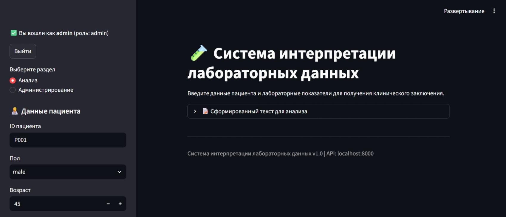
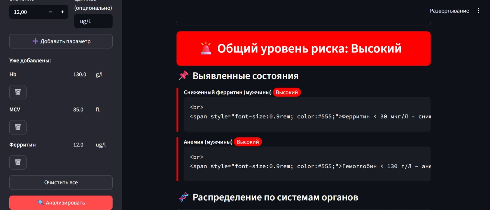
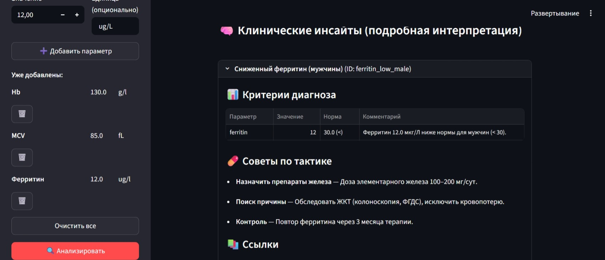
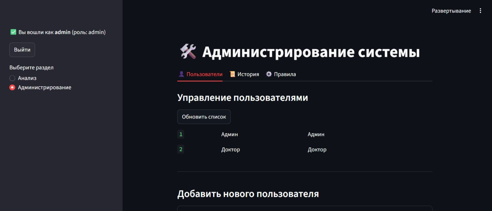

# 🧪 MedCDSS-RB — Rule-Based система интерпретации лабораторных данных

[](https://www.python.org/)
[](https://fastapi.tiangolo.com/)
[](https://www.docker.com/)
[](https://streamlit.io/)
[](https://opensource.org/licenses/MIT)
[](https://github.com/9577030-png/MedCDSS-RB/actions)

**Rule-based система для интерпретации лабораторных данных.** Анализирует результаты анализов и выдаёт структурированное заключение с рекомендациями, оценкой риска и клиническими инсайтами — шпаргалкой для врача, а не автоматическим диагнозом.

> **English:** A rule-based laboratory data interpretation system that produces a structured report with recommendations, risk assessment, and clinical insights — a cheat sheet for clinicians, not an automated diagnosis.

> ⚠️ **Это не медицинское устройство.** Подробности — в разделе [«Ограничения»](#-безопасность-и-ограничения) ниже.

---

## 📸 Скриншоты

| Интерфейс | Результат | Инсайты | Админка |
|-----------|-----------|---------|---------|
|  |  |  |  |

---

## ✨ Ключевые возможности

| Категория | Описание |
|-----------|----------|
| **🧪 Интерпретация** | **243 клинических правила** (13 enriched + 230 basic), 14 специальностей, 455 диагностических критериев |
| **⚥ Пол** | Половозависимые референсные интервалы для параметров вроде гемоглобина, ферритина |
| **🔗 Комбинации** | Синдромы на основе нескольких находок (гиперпаратиреоз, септический синдром и др.) |
| **📋 Заключение** | Группировка по системам органов, дедупликация конфликтующих находок, группировка низкоспецифичных находок по параметру |
| **🧠 Инсайты** | Критерии, дифференциальная диагностика, красные флаги, тактика — для 13 enriched-правил |
| **👨‍⚕️ Рекомендации** | Специальность, срочность, перечень дополнительных тестов |
| **📊 История** | SQLite с загрузкой последнего отчёта по ID пациента |
| **🔐 Безопасность** | JWT-аутентификация с ролями (`admin`, `doctor`, `user`), случайные пароли по умолчанию |
| **🖥️ UI** | Streamlit с автодополнением, цветовой индикацией риска |
| **📄 PDF** | Экспорт заключения с поддержкой кириллицы |
| **🔄 Горячая загрузка** | Обновление правил без перезапуска контейнера |
| **🐳 Docker** | Запуск одной командой (`docker-compose up -d`) |

---

## 🏗️ Архитектура

Проект следует принципам **чистой архитектуры** (Clean Architecture / Ports & Adapters):

```
MedCDSS-RB/
├── domain/           # Ядро (сущности, value objects, чистая логика)
├── application/      # Сценарии использования и порты (интерфейсы)
├── infrastructure/    # Адаптеры (загрузчики, парсер, хранилище, DI-контейнер)
├── api/               # REST API (FastAPI, JWT)
├── knowledge/         # Конфигурация в YAML (пороги, правила, интерпретации)
├── tests/              # pytest (44 теста)
├── docs/               # Документация (этот README ссылается на docs/*.md)
└── streamlit_app.py    # Веб-интерфейс
```

Подробный разбор компонентов и потока данных — в [`docs/architecture.md`](docs/architecture.md).

**Технологический стек:** Python 3.13, FastAPI, Pydantic, PyYAML, SQLite (SQLAlchemy), Redis, JWT, ReportLab, Streamlit, Docker.

---

## 🚀 Быстрый старт

### Docker (рекомендуется)

```bash
git clone https://github.com/9577030-png/MedCDSS-RB.git
cd MedCDSS-RB
docker-compose up -d
```

После запуска:
- API: http://localhost:8000/docs
- UI: http://localhost:8501

**Учётные записи при первом запуске создаются с СЛУЧАЙНЫМ паролем**, а не фиксированным `admin/admin`. Пароль печатается в лог контейнера один раз и больше нигде не хранится в открытом виде:

```bash
docker-compose logs api | grep "паролем"
```

Смените его сразу после первого входа. Подробнее про `.env` и переменные окружения — в [`docs/installation.md`](docs/installation.md).

### Локальный запуск

```bash
pip install -e .
python app.py
streamlit run streamlit_app.py   # в другом терминале
```

---

## 📚 Документация

| Файл | Содержание |
|------|------------|
| [`docs/installation.md`](docs/installation.md) | Установка, переменные окружения, устранение неполадок |
| [`docs/api.md`](docs/api.md) | Все эндпоинты с примерами запросов/ответов |
| [`docs/configuration.md`](docs/configuration.md) | Формат YAML-конфигов, как их редактировать |
| [`docs/architecture.md`](docs/architecture.md) | Слои Clean Architecture, поток данных, DI-контейнер |
| [`docs/clinical_rules.md`](docs/clinical_rules.md) | Список правил, как добавить новое |
| [`docs/AUDIT.md`](docs/AUDIT.md) | Журнал аудита: какие баги были найдены и как исправлены |

---

## 🧪 Тестирование

```bash
pytest -v
```

44 теста, 0 failed. `flake8 --select=E9,F63,F7,F82` — чисто по всему репозиторию.

---

## 🩺 Клинические инсайты (шпаргалка для врача)

Для 13 **enriched**-правил (острые электролитные нарушения, дефициты B12/фолиевой кислоты, целиакия, инфекции и др.) система даёт полный набор: критерии срабатывания, дифференциальную диагностику, красные флаги, тактику. Остальные 230 правил — **basic**: только пороговое срабатывание и общая рекомендация, без развёрнутого текста. Список того, что enriched, а что нет — в [`docs/clinical_rules.md`](docs/clinical_rules.md), деление явно закодировано в системе (`RuleTier`), а не является случайным.

---

## 🔐 Безопасность и ограничения

### ⚠️ Важное предупреждение

**Эта система не является медицинским устройством и не заменяет врача.** Она предназначена для образовательных целей и как вспомогательная шпаргалка. Все выводы должны быть проверены квалифицированным специалистом. Автор не несёт ответственности за использование в реальной клинической практике.

### Известные ограничения (сознательно не скрываем)

- **Парсер рассчитан на ручной/скопированный текст**, не на сканы бланков или OCR — это осознанный выбор под сценарий «шпаргалка», а не недоработка.
- **230 из 243 правил — basic-уровня**: срабатывают по одному лабораторному порогу без клинического контекста (возраст, сопутствующие заболевания, анамнез не учитываются).
- **Пороги не проходили внешнюю клиническую валидацию** — использованы общепринятые референсные значения, но не заменяют консультацию врача или локальные лабораторные нормы.
- Полная история решённых архитектурных проблем — в [`docs/AUDIT.md`](docs/AUDIT.md).

---

## 👨‍💻 Для кого эта система?

- **Врачам** — как вспомогательная шпаргалка, не как источник диагноза.
- **Разработчикам** — как референсная реализация rule-based экспертной системы на Clean Architecture.
- **Студентам** — как учебный проект с полным стеком (Python, FastAPI, Docker, Streamlit, JWT, YAML, CI/CD).

---

## 🤝 Контакты

Автор: Сергей Смирнов
GitHub: [9577030-png](https://github.com/9577030-png)
Email: 9577030@gmail.com
Telegram: @smirnov-kos

## 📄 Лицензия

MIT License — свободное использование, модификация и распространение с указанием авторства.
